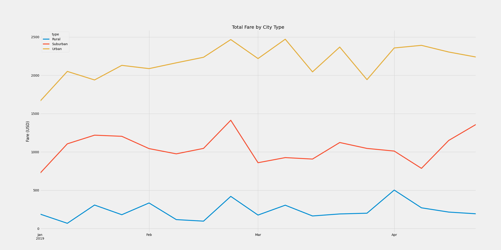

# PyBer_Analysis - John Morrissey 

## Overview

The purpose of this analysis is to look into different characteristics of ride shares in several city types. We will use Python, Pandas, and Myplotlib to draw conclusions about ride shares in rural, suburban, and urban areas. This analysis will help us make more informed business decisions in the future. 

## Results 

As you can see from the above figure, Urban rides make up over two thirds of the total rides analyzed. This could be attributed to population density. Cars are more difficult to park, there is more traffic in the city, ride distances are usually shorter, and the availability of drivers within a short distance is ususally greater. 

As you can see in the above chart, the total fares collected were much higher in the city. Urban fares were higher than suburban and rural areas combined. Though, if you factor in average fair charged per ride, you see Urban areas have the lowest at $31 dollars. This can be explained with the availability of drivers, as well as shorter distances per ride. 

Average fare per driver was the opposite. Rural drivers earned the highest fair per driver and urban had the lowest. This could be because of an abundance of drivers in urban areas, or possibly more urban drivers spend less time a week on the job, and treat ride share as more of a supplementary gig. 

## Summary 

From the analysis we can make some conclusions. Ride share revenue is far and above higher in the city due to demand. We see that the average ride is lower in the city, but the number of overall rides is much higher. Since the average fare per driver is lowest in the city, this may mean that there is more competition. In a rural area you can expect less revenues, but a higher revenue per ride. Rural areas also have the least competition out of the three city types analyzed. If the company has a competetive advantage over other ride share companies, they would definitely want to do so in the city because that's where the demand and money is. Certain rural areas may be undersaturated with drivers, and may present a good opportunity for the company. 